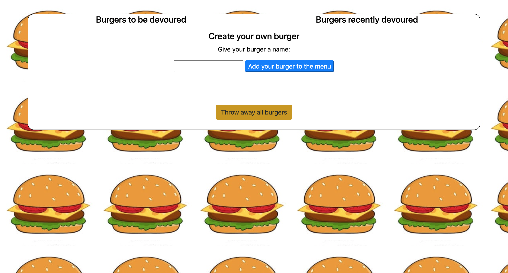

# Burger-Application

## Description

This is an application that provides the user the ability to name and create their own burgers, 'devour' any available burger that hasn't already been devoured, and to throw everything away and start fresh. The technologies being used are Node, Express, mySQL, and ORM. All while also following the MVC structure.

**## Table of Contents**

1. [Installation Instructions](#installation-instructions)
2. [Usage Information](#usage-information)
3. [Test Instructions](#test-instructions)
4. [Questions](#questions)

## Installation Instructions

If SSH keys are installed, you can install the program by cloning it to your local machine by running git clone git@github.com:dolanpettit/Burger-Application.git. Once you have succesfully cloned to your local machine, be sure to install all required dependencies for application by running "npm i" in the command line. You will also want to connect your local machine to a mySQL database and input the schema.sql file. Without the database connected, this application will not be able to work properly.

## Usage Information

This application is deployed on Heroku and can be accessed by visiting this link: <a src="https://git.heroku.com/fierce-mesa-56796.git">Deployed link</a>

## Test Instructions

There are currently no testing suites for this application.

# Questions

For any questions about this assignment, feel free to reach out to me on github or my email.

https://github.com/dolanpettit

dolanpettit@gmail.com
